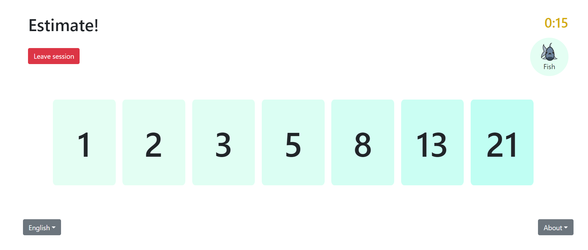

# Users Guide

*Guide for all users of Diveni.*

Diveni is a web application for Planning-Poker sessions. Sprint Planning often requires teams to
meet to estimate and plan user stories. With Diveni more flexibility is provided, team members can
do interactive planning from different locations. In addition, the mobile application offers JIRA
and Azure Devops integration.

By the way: "diveni" is Esperanto for "guess": <https://en.wiktionary.org/wiki/diveni>

## Roles

There are two roles of users:

* **Host**: Person which starts, configures and hosts planning session.
* **Team**: Persons voting User Stories.

---

## 1. Create new Session

To create a new session click on the "GO" button of the left window "New session".

 


After this you will be sent to *Prepare Session* page where you can customize the upcoming voting 
session for your team.

As first step you choose the mode for your User Stories. You can choose to estimate 

* Without User Stories 
* With User Stories created within Diveni. You are then able to create User Stories on the right side.
* With User Stories imported from an issue tracker. Choosing the last option you’ll have to connect to
  your JIRA or Azure account. It will be explained how to connect and how to choose the correct project.

Any mode specific information is given below the chosen mode.


## 1.1 Create new Session without User Stories

At "Planning without User Stories" you will vote with your selected cards and will not be able to add
User Stories once you've started the session.

- In the second row, you can decide which poker card set will be used for the upcoming voting
  session. You can choose between different sets: Fibonacci, T-shirt sizes (not for issue trackers),
  hours or integer values. You can also select individually the range of each card set, including
  an additional ```?```.

  

- In the third row, you can specify a timer for the voting session. The timer will automatically be
  initialized when starting the voting session. The value of the timer can be changed by clicking on
  the buttons on the left and right. The voting will automatically be stopped and the results will be
  shown when the timer hits zero.

  

- In the fourth row, you can choose if you want to let the host vote aswell on the userstories. You can easily
  change this value by clicking on one of these buttons. If you dont click any button the option to vote on the
  userstories is disabled for the host. But you can also change this later on.

  

- To finish the setting, you can secure your session by an optional password.

  

- Finalize by clicking „Start Session“ on the bottom of the page.
- You get a code that the other members who want to join need.
  
- When all Members have joined the session you can start the planning
  - Host:
    - After starting the planning the counter with the selected time starts and the members can vote. 
    - Going to "Show result" finishes the estimation previously and you can see the result before the time is over.
      
    - When the estimation is done you can see the result as a host. If you want to start a new voting you have to click on the "New"-Button.
      
    - You also have the option to remove members from the session. Therefore you must move your mouse over the member then a red X-Button appears. Click on this one and the window in the picture will pop up. By selecting "Remove" the member will be removed from the session.
    
  - Member:
    - As a member you got to "Join Session" after starting the application.
    - There you have to type in a name and the code you get from the host. Optionally you can select a password.
      
    - After joining the session you have to wait until the host starts a voting. Depending oft the choice of the card set with its values from the host you see the cards you can choose between. In this example it's the Fibonacci-card set with values from 1 to 21. By selecting the value you think is most appropriate, you give your estimation.
      

## 1.2 Create new Session with User Stories

At "Planning with User Stories" you can import user stories before starting the session. You can add more stories and vote with your selected 
cards once you've started the session.

  - Import User Stories
    - You can import user stories from a comma separated values file (CSV). The CSV file has the following format:
  
      ```
      title;description;estimation
      Test User Story;Test description of user story;2
      ...
      ```
    - The first line contains the header with the description of the fields. It will be ignored by the import.
    - The import is started by pressing the "Import User Stories" button
  - All following steps for the creation of a new session are the same as described under 1.1.

## 1.3 Create new Session with connection to an issue tracker

## 2 Join Session

## Invite Team Members

## Start Session

Once everybody of your team has joined your session, you can start the session. While you are waiting for your team members to join, you can change some settings for your session.

  - The admin of the session can vote
    - As the admin of the session you can choose to vote aswell or to only let your members vote on the userstories.
      
    - While the Estimation is running, you cannot change the voting option.

## Start voting of User Story


## Screenshots


